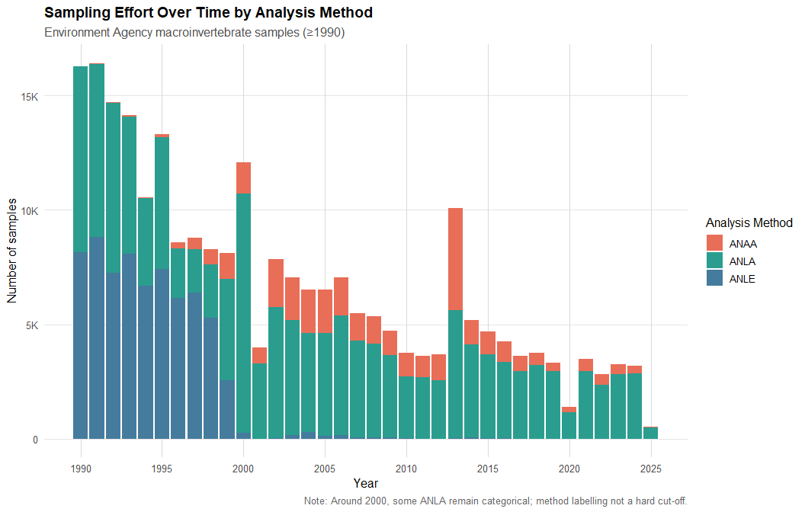
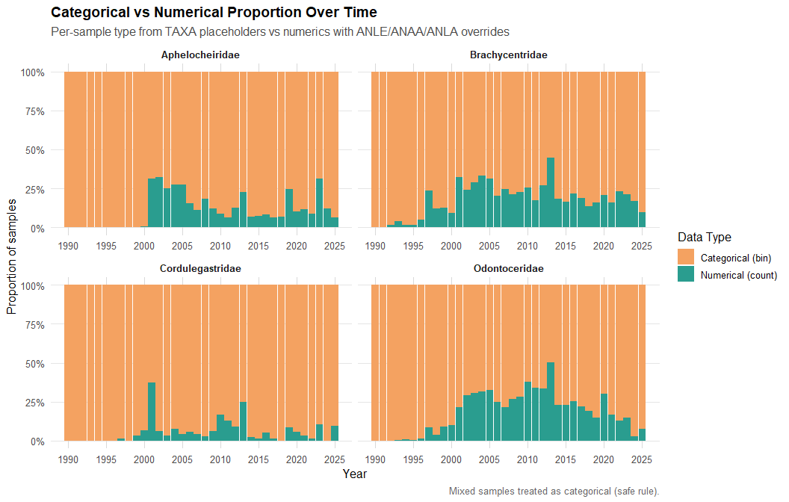
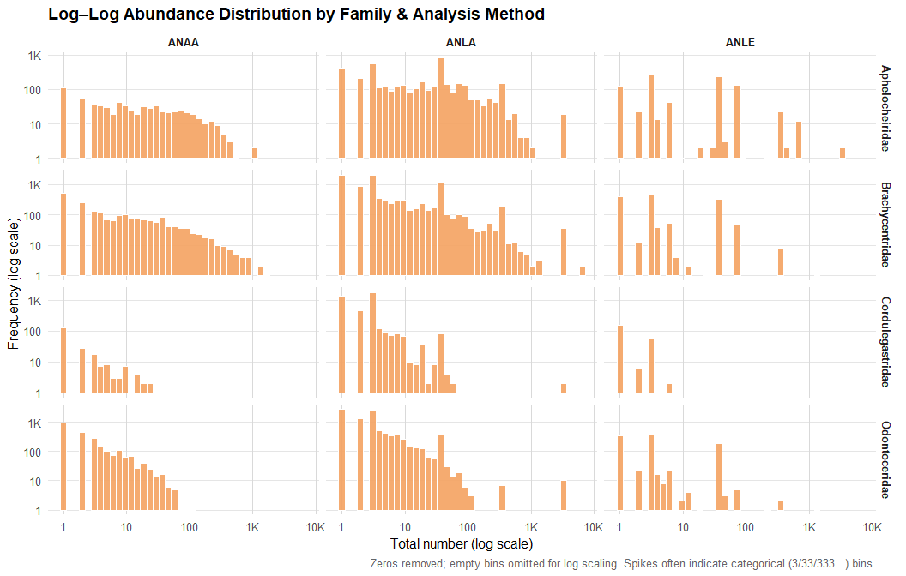
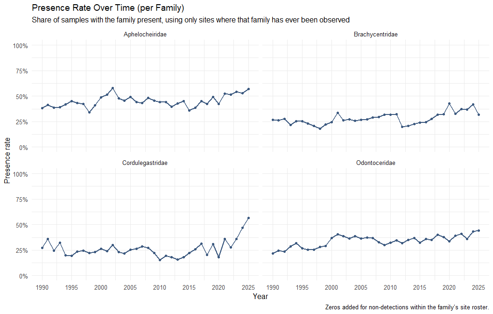
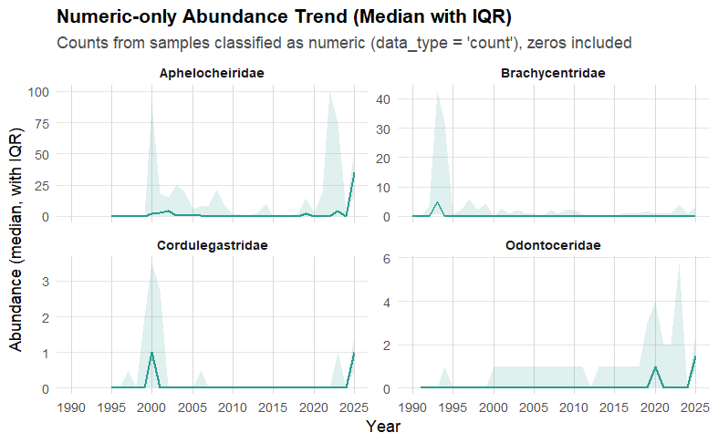

# Freshwater Macroinvertebrates Analysis

## 📌 Overview

This project analyses long-term freshwater macroinvertebrate data from England to understand biodiversity trends over time. The dataset spans multiple decades and includes complex ecological observations collected using different sampling and analysis methods.

The goal of this project is to transform large-scale, messy environmental data into structured insights using a robust data science pipeline and appropriate statistical modelling techniques.

---

## ⚠️ Key Challenges

The dataset presents several real-world challenges:

* Mixed data types: categorical abundance bands (e.g. 1, 3, 33, 333) and numeric counts
* Inconsistent recording methods across time (ANAA, ANLA, ANLE)
* Missing values and implicit absences
* Duplicate samples at site-date level
* Seasonal sampling bias (spring vs autumn)

Handling these challenges correctly is critical to producing reliable ecological insights.

---

## 🧹 Approach

A structured, reproducible pipeline was developed:

1. **Data Ingestion**

   * Large-scale datasets loaded using `arrow` for efficient, lazy evaluation

2. **Data Cleaning**

   * Filtering relevant sampling methods
   * Removing duplicates
   * Standardising formats across datasets
   * Restricting analysis to post-1990 data

3. **Data Preprocessing**

   * Classification of observations into:

     * **Categorical (bin-based)**
     * **Numerical (count-based)**
   * Integration of multiple data sources (sites, metrics, taxa, WHPT)
   * Feature engineering (season, temporal variables)

4. **Modelling Dataset Construction**

   * Presence/absence datasets
   * Ordinal categorical datasets
   * Censored count datasets

---

## 📊 Modelling Strategy

Multiple statistical approaches were applied to account for data complexity:

* **Presence/Absence Models (Binomial GAM)**
* **Ordered Categorical Models (Ordinal GAM)**
* **Censored Poisson Models**
* **Censored Normal Models**

These approaches allow proper handling of uncertainty and mixed measurement systems within the dataset.

---

## 📈 Key Results

* Evidence of long-term changes in macroinvertebrate abundance
* Differences observed between seasonal sampling periods
* Transition from categorical to numerical recording over time
* Consistent trends across multiple modelling approaches

---

## 📊 Key Visualisations

### Sampling Effort Over Time



### Data Type Proportion (Categorical vs Numerical)



### Abundance Distribution (Log–Log Scale)



### Presence Rate Trends



### Numeric Abundance Trend



---

## 🧠 Key Learning

This project demonstrates:

* The importance of robust data cleaning in real-world datasets
* Handling mixed data types and uncertainty correctly
* Applying appropriate statistical models for ecological data
* Building reproducible and scalable data science workflows

---

## 🌍 Relevance to Public Good

This work contributes to understanding freshwater biodiversity trends and supports environmental monitoring and policy development. It demonstrates how data science can be used beyond commercial applications to address challenges related to sustainability and ecological conservation.

---

## 📂 Repository Structure

```
data/        → raw and processed datasets (not included due to size)
scripts/     → full data pipeline (loading, cleaning, modelling)
figures/     → key visualisations
outputs/     → final report and results
notebooks/   → simplified project overview
```

---

## 🚀 Reproducibility

To reproduce the analysis:

1. Download the required datasets (Environment Agency open data)
2. Place `.parquet` files in `data/raw/`
3. Run scripts in order:

```
01_data_loading.R
02_data_cleaning.R
03_preprocessing.R
04_eda.R
05_modelling.R
```

---

## 📄 Full Report

The complete project report is available here:

👉 `outputs/report.pdf`

---

## 🛠️ Technologies Used

* R
* tidyverse (dplyr, tidyr, ggplot2, purrr)
* arrow
* mgcv (GAM modelling)
* gratia (model diagnostics)

---

## 📌 Author

Tilak Heble
Data Science | Environmental Analytics | Statistical Modelling
